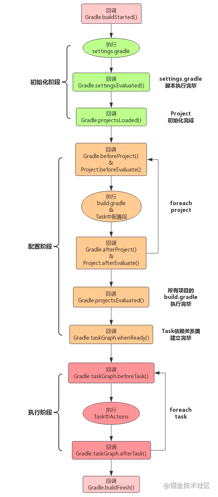

Table of Contents
=================

* [gradle笔记尝试记录以下内容](#gradle笔记尝试记录以下内容)
    * [初始化阶段](#初始化阶段)
* [Gradle生命周期](#Gradle生命周期)

# gradle笔记尝试记录以下内容
gradle 目前尝试从以下几个方向记录笔记，后续如果有新增知识，在提纲处继续添加完善
* 1、Gradle基础入门
* 2、Gradle如何创建Task
* 3、Task进阶学习
* 4、Project详解
* 5、Extension详解
* 6、Gradle构建生命周期
* 7、统计 Task 执行时长
* 8、一些有用的小技巧

# Gradle生命周期
> 无论什么时候执行 Gradle 构建，都会运行3个不同的生命周期阶段：初始化、配置、执行

## 初始化阶段
初始化阶段的任务是创建项目的层次结构，并且为每一个项目创建一个 **`Project`** 实例。与初始化阶段相关的脚本文件是 **`settings.gradle`**，一个settings.gradle脚本对应一个 **`Setting`** 对象。

## 配置阶段
&emsp;&emsp;配置阶段的任务是执行各项目下的 **`build.gradle`**脚本，完成 Project 的配置，并且构造 Task 任务依赖关系图以便在执行阶段按照依赖关系执行 Task。

&emsp;&emsp;每个build.gradle脚本文件对应一个 **`Project`** 对象，在初始化阶段。

&emsp;&emsp;**`需要理解的一个地方`** 配置阶段执行的代码包括：build.gradle中的各种语句、闭包以及 **`Task`** 中的配置语句，在根目录的 **`build.gradle`** 中添加如下代码：

在主工程目录添加相关日志，编译日志如下：
```
[配置阶段代码执行test] dependencies中的代码
[配置阶段代码执行test] test start
[配置阶段代码执行test] Task中的配置代码
Task中配置的代码
[配置阶段代码执行test] test end
```
结合上面日志可以看出，在配置阶段，不仅执行build.gradle中的语句，还包括了 **`Task`** 中的配置语句。

从上面的执行结果可以看出，在配置阶段，除了 **`Task`** 中除了Action外的代码段都在配置阶段执行。

## gradle 生命周期相关的一些API
```
Project 提供的生命周期回调方法：
> beforeEvaluate()          // project 开始配置前回调
> afterEvaluate()           // project 配置成功回调

Gradle 提供的生命周期回调方法：
> beforeProject()           // 每一个 project 配置前回调
> afterProject()            // 每一个 project 配置结束回调
> projectsEvaluated()       // 所有的 project 都配置完成后回调
> projectsLoaded()          // Project 初始化完成
> settingsEvaluated()       // settings.gradle 脚本执行完毕
> taskGraph.whenReady()
> taskGraph.beforeTask()
> taskGraph.afterTask()
```
### deforeEvaluate容易被误用
**`beforeEvalute`** 是在 project 开始配置前调用，当前的 project 作为参数传递给闭包。

这个方法容易被误用，如果是直接在当前子模块的 build.gradle 中使用是肯定不会调用到的，因为 project 开始配置以后，才会进入到 project 对应的gradle.build的代码块中，此时配置已经开始了。所以需要在根目录的 build.gradle 中配置才可以接收到回调。
```groovy
project.subprojects { sub ->
    sub.beforeEvaluate { project ->
        println "Evaluate before of " + project.path 
    }
}
```


